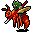
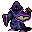
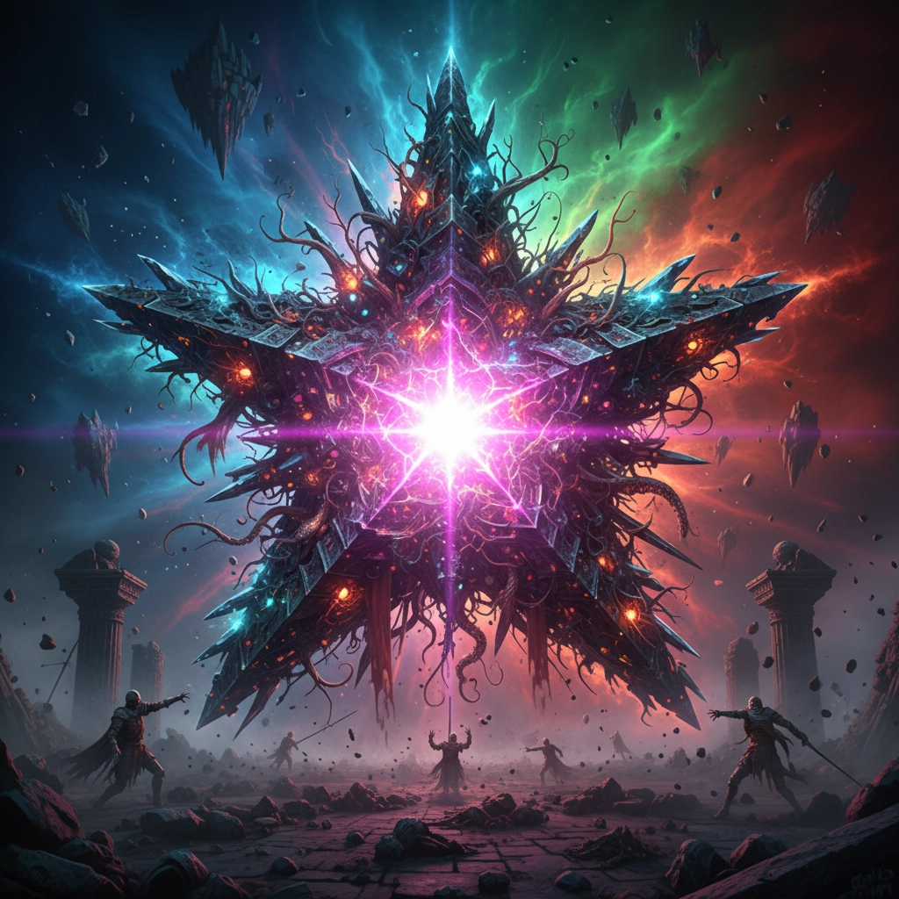
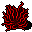
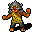
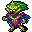

# 🏰 Tool for Creating Fan Gallery for Any Roguelike Game

The game [Dungeon Crawl: Stone Soup](https://en.wikipedia.org/wiki/Dungeon_Crawl_Stone_Soup) was used as an example. Enjoy.

> [!IMPORTANT]
> This project is **NOT A MOD**, not a call for modification of the Game, but a **tribute to the DCSS developers and the community** that created one of the most magnificent roguelikes in history. This is just a demo.
> It would never have existed without the awesome descriptions of creatures and perfectly readable sprites created by the [community](https://reddit.com/r/dcss).

_If you write an article about **Dungeon Crawl: Stone Soup** and/or **this project**, let me know and I'll post the URL of the article in the **README**_ 🤝

Share some ❤️ and star repo to support this project.

## 🔗 [Demo >](https://syrokomskyi.github.io/x-scale-dungeon-crawl-sprite/)

## 🎨 Sprite Source

<https://github.com/crawl/crawl>

## ⚙️ Transform

See the `README.md` in each `./apps/sprites/work/` folder.

For transform sprites run the script in terminal.

---

### 👹 [Monsters](./apps/sprites/work/redraw-v1/mon)

#### 👥 [Humanoids](./apps/sprites/work/redraw-v1/mon/humanoids)

<table style="border-collapse: collapse;">
  <tr>
    <td style="border-right: 2px solid #222; border-bottom: 2px solid #222; width: 50%; height: auto;text-align: center; vertical-align: bottom;"></td>
    <td style="border-left: 2px solid #222; border-bottom: 2px solid #222; width: 50%; height: auto;text-align: center; vertical-align: bottom;"></td>
  </tr>
  <tr>
    <td style="border-right: 2px solid #222; border-top: 2px solid #222; width: 50%; height: auto;text-align: center; vertical-align: top;"> <strong>Juggernaut</strong> A gigantic humanoid with thick iron plates welded to its skin. It moves with alarming speed and deals incredible damage with its immense fists, but must rest between blows.</td>
    <td style="border-left: 2px solid #222; border-top: 2px solid #222; width: 50%; height: auto;text-align: center; vertical-align: top;"> <strong>Water Nymph</strong> A capricious nature spirit, deeply bonded with the waters in which it lives. Wherever they flow, so may it, and ponds and rivers surge and leap at its whim.</td>
  </tr>
</table>

<table style="border-collapse: collapse;">
  <tr>
    <td style="border-right: 2px solid #222; border-bottom: 2px solid #222; width: 50%; height: auto;text-align: center; vertical-align: bottom;"></td>
    <td style="border-left: 2px solid #222; border-bottom: 2px solid #222; width: 50%; height: auto;text-align: center; vertical-align: bottom;"></td>
  </tr>
  <tr>
    <td style="border-right: 2px solid #222; border-top: 2px solid #222; width: 50%; height: auto;text-align: center; vertical-align: top;"> <strong>Troll</strong> A huge and physically powerful humanoid creature. Short on intelligence but long on brawn, its thick knobbly hide heals rapidly from most wounds.</td>
    <td style="border-left: 2px solid #222; border-top: 2px solid #222; width: 50%; height: auto;text-align: center; vertical-align: top;"> <strong>Eleionoma</strong> Spirits of marshes and bogs. From the cypresses and willows of the fens stems the power of these fierce protective spirits. With the boughs and branches they flow, emerging from trees near their foes to strike.</td>
  </tr>
</table>

<table style="border-collapse: collapse;">
  <tr>
    <td style="border-right: 2px solid #222; border-bottom: 2px solid #222; width: 50%; height: auto;text-align: center; vertical-align: bottom;"></td>
    <td style="border-left: 2px solid #222; border-bottom: 2px solid #222; width: 50%; height: auto;text-align: center; vertical-align: bottom;"></td>
  </tr>
  <tr>
    <td style="border-right: 2px solid #222; border-top: 2px solid #222; width: 50%; height: auto;text-align: center; vertical-align: top;"> <strong>Spriggan Rider</strong> A spriggan that has tamed a hornet as its mount, and is tasked with protecting the spriggan fens and cairns from intruders.</td>
    <td style="border-left: 2px solid #222; border-top: 2px solid #222; width: 50%; height: auto;text-align: center; vertical-align: top;"> <strong>Occultist</strong> A wizard fond of illusion and treachery. They scorn the crudeness of other magicians, who hurl wild conjurations toward their foes rather than cunningly exploiting their greatest weaknesses.</td>
  </tr>
</table>

#### 👁️ [Eyes](./apps/sprites/work/redraw-v1/mon/eyes)

<table style="border-collapse: collapse;">
  <tr>
    <td style="border-right: 2px solid #222; border-bottom: 2px solid #222; width: 50%; height: auto;text-align: center; vertical-align: bottom;"></td>
    <td style="border-left: 2px solid #222; border-bottom: 2px solid #222; width: 50%; height: auto;text-align: center; vertical-align: bottom;"></td>
  </tr>
  <tr>
    <td style="border-right: 2px solid #222; border-top: 2px solid #222; width: 50%; height: auto;text-align: center; vertical-align: top;"> <strong>Golden Eye</strong> A tiny and shimmering floating eye, swift as the wind and glistening like gold. It has a peculiarly hypnotic look.</td>
    <td style="border-left: 2px solid #222; border-top: 2px solid #222; width: 50%; height: auto;text-align: center; vertical-align: top;"> <strong>Glass Eye</strong> A floating eyeball formed from living glass. Only the divine Jiyva could form such a curious servitor.</td>
  </tr>
</table>

#### 🐉 [Dragons](./apps/sprites/work/redraw-v1/mon/dragons)

<table style="border-collapse: collapse;">
  <tr>
    <td style="border-right: 2px solid #222; border-bottom: 2px solid #222; width: 50%; height: auto;text-align: center; vertical-align: bottom;"></td>
    <td style="border-left: 2px solid #222; border-bottom: 2px solid #222; width: 50%; height: auto;text-align: center; vertical-align: bottom;"></td>
  </tr>
  <tr>
    <td style="border-right: 2px solid #222; border-top: 2px solid #222; width: 50%; height: auto;text-align: center; vertical-align: top;"> <strong>Wind Drake</strong> A small but powerful dragon, particularly adept amongst its kin at manipulating the currents of air that surround it. It can exhale powerful blasts of wind.</td>
    <td style="border-left: 2px solid #222; border-top: 2px solid #222; width: 50%; height: auto;text-align: center; vertical-align: top;"> <strong>Lindwurm</strong> A small serpentine dragon with a pair of strong forelimbs. Its thick scales give off an eerie red glow.</td>
  </tr>
</table>

#### 🐟 [Aquatic](./apps/sprites/work/redraw-v1/mon/aquatic)

<table style="border-collapse: collapse;">
  <tr>
    <td style="border-right: 2px solid #222; border-bottom: 2px solid #222; width: 50%; height: auto;text-align: center; vertical-align: bottom;"></td>
    <td style="border-left: 2px solid #222; border-bottom: 2px solid #222; width: 50%; height: auto;text-align: center; vertical-align: bottom;"></td>
  </tr>
  <tr>
    <td style="border-right: 2px solid #222; border-top: 2px solid #222; width: 50%; height: auto;text-align: center; vertical-align: top;"> <strong>Rock Fish</strong> A strange stone-scaled fish that swims through solid rock with the same ease that most fish do through water.</td>
    <td style="border-left: 2px solid #222; border-top: 2px solid #222; width: 50%; height: auto;text-align: center; vertical-align: top;"> <strong>Swamp Worm</strong> A large slimy worm, adept at traversing swamps and marshes.</td>
  </tr>
</table>

#### 🌌 [Abyss](./apps/sprites/work/redraw-v1/mon/abyss)

<table style="border-collapse: collapse;">
  <tr>
    <td style="border-right: 2px solid #222; border-bottom: 2px solid #222; width: 50%; height: auto;text-align: center; vertical-align: bottom;"></td>
    <td style="border-left: 2px solid #222; border-bottom: 2px solid #222; width: 50%; height: auto;text-align: center; vertical-align: bottom;"></td>
  </tr>
  <tr>
    <td style="border-right: 2px solid #222; border-top: 2px solid #222; width: 50%; height: auto;text-align: center; vertical-align: top;"> <strong>Tentacled Starspawn</strong> A lumbering maw shrouded in a mass of sinuous tentacles. On spotting prey, its tentacles lunge outward, dragging victims directly to its waiting gullet.</td>
    <td style="border-left: 2px solid #222; border-top: 2px solid #222; width: 50%; height: auto;text-align: center; vertical-align: top;"> <strong>Wretched Star</strong> A conflux of unearthly light and energy, awash in unnatural colours and strange forms no normal being was meant to perceive. It fills all those in its presence with the disorder of the Abyss.</td>
  </tr>
</table>

#### 🌟 [Unique](./apps/sprites/work/redraw-v1/mon/unique)

<table style="border-collapse: collapse;">
  <tr>
    <td style="border-right: 2px solid #222; border-bottom: 2px solid #222; width: 50%; height: auto;text-align: center; vertical-align: bottom;"></td>
    <td style="border-left: 2px solid #222; border-bottom: 2px solid #222; width: 50%; height: auto;text-align: center; vertical-align: bottom;"></td>
  </tr>
  <tr>
    <td style="border-right: 2px solid #222; border-top: 2px solid #222; width: 50%; height: auto;text-align: center; vertical-align: top;"> <strong>Erica</strong> A wild-tempered adventuress. She's quite prideful for an octopode, and brandishes their venomous capacity and camouflage talents with cruel force.</td>
    <td style="border-left: 2px solid #222; border-top: 2px solid #222; width: 50%; height: auto;text-align: center; vertical-align: top;"> <strong>Robin</strong> A mountain hobgoblin, recently come in search of the legendary Orb. Not foolhardy or reckless enough to delve into the depths of the Dungeon alone, Robin has built a small army of minions. Potential competitors will quickly find a stream of screaming goblins flying toward them!</td>
  </tr>
</table>

<table style="border-collapse: collapse;">
  <tr>
    <td style="border-right: 2px solid #222; border-bottom: 2px solid #222; width: 50%; height: auto;text-align: center; vertical-align: bottom;"></td>
    <td style="border-left: 2px solid #222; border-bottom: 2px solid #222; width: 50%; height: auto;text-align: center; vertical-align: bottom;"></td>
  </tr>
  <tr>
    <td style="border-right: 2px solid #222; border-top: 2px solid #222; width: 50%; height: auto;text-align: center; vertical-align: top;"> <strong>Arachne</strong> Once a talented human weaver, Arachne was transformed into a monstrous half-spider by a jealous rival's curse. Driven out of her village, she found sanctuary for a time among the jorogumo before a bitter feud forced her to flee once more. Now she wanders other corners of the dungeon with a small retinue of loyal students in tow, seeking a new domain in which they can spin their peerless tapestries in peace.</td>
    <td style="border-left: 2px solid #222; border-top: 2px solid #222; width: 50%; height: auto;text-align: center; vertical-align: top;"> <strong>Mennas</strong> There was once a human priest named Mennas. He travelled far and wide as a missionary of Zin, often venturing even into Orcish lands. He beseeched the orcs to abandon their false tribes and return to the peoples of their birth; only Zin's light could truly cleanse the weight of sin that had twisted their bodies.</td>
  </tr>
</table>

<table style="border-collapse: collapse;">
  <tr>
    <td style="border-right: 2px solid #222; border-bottom: 2px solid #222; width: 50%; height: auto;text-align: center; vertical-align: bottom;"></td>
    <td style="border-left: 2px solid #222; border-bottom: 2px solid #222; width: 50%; height: auto;text-align: center; vertical-align: bottom;"></td>
  </tr>
  <tr>
    <td style="border-right: 2px solid #222; border-top: 2px solid #222; width: 50%; height: auto;text-align: center; vertical-align: top;"> <strong>Enchantress</strong> First and most fearful of her kind, the Enchantress rules over the spriggans of the dungeon. She wears an opalescent outfit made of dragon skin that shimmers with many colours.</td>
    <td style="border-left: 2px solid #222; border-top: 2px solid #222; width: 50%; height: auto;text-align: center; vertical-align: top;"> <strong>Kirke</strong> A master of transformation and treachery. Beware, or you may be the next swine to join her herd!</td>
  </tr>
</table>

---

Created [with ❤️](https://syrokomskyi.com "Andrii Syrokomskyi")

