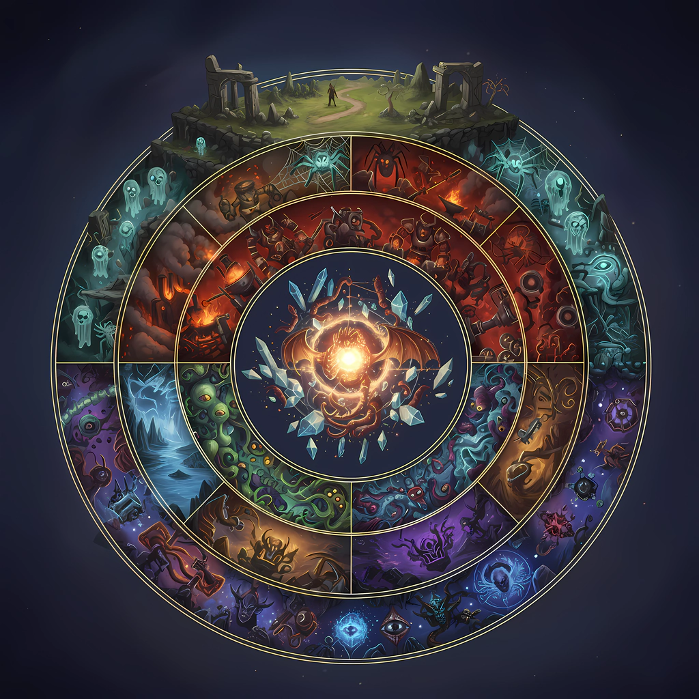

# Dungeon Crawl: Stone Soup - Large Sprites

Large images for the game [Dungeon Crawl: Stone Soup](https://en.wikipedia.org/wiki/Dungeon_Crawl_Stone_Soup). Enjoy.

Share some ❤️ and star repo to support the [Large Sprites](https://github.com/syrokomskyi/x-scale-dungeon-crawl-sprite) for the `Dungeon Crawl: Stone Soup`.

_If you write an article about **Dungeon Crawl: Stone Soup**, let me know and I'll post the URL of the article in the **README**_ 🤝

## Sprite Source

<https://github.com/crawl/crawl>

## Transform

See `README.md` in every `./sprites/work/` folder.

For transfrom sprites run the script in terminal.

---

### [Monsters](./apps/sprites/work/redraw-v1/mon)

#### [Humanoids](./apps/sprites/work/redraw-v1/mon/humanoids)

|  |  |
|:---:|:---:|
| **Juggernaut** A gigantic humanoid with thick iron plates welded to its skin. It moves with alarming speed and deals incredible damage with its immense fists, but must rest between blows. | **Water Nymph** A capricious nature spirit, deeply bonded with the waters in which it lives. Wherever they flow, so may it, and ponds and rivers surge and leap at its whim. |

|  |  |
|:---:|:---:|
| **Troll** A huge and physically powerful humanoid creature. Short on intelligence but long on brawn, its thick knobbly hide heals rapidly from most wounds. | **Eleionoma** Spirits of marshes and bogs. From the cypresses and willows of the fens stems the power of these fierce protective spirits. With the boughs and branches they flow, emerging from trees near their foes to strike. |

|  |  |
|:---:|:---:|
| **Spriggan Rider** A spriggan that has tamed a hornet as its mount, and is tasked with protecting the spriggan fens and cairns from intruders. | **Occultist** A wizard fond of illusion and treachery. They scorn the crudeness of other magicians, who hurl wild conjurations toward their foes rather than cunningly exploiting their greatest weaknesses. |

#### [Eyes](./apps/sprites/work/redraw-v1/mon/eyes)

|  |  |
|:---:|:---:|
| **Golden Eye** A tiny and shimmering floating eye, swift as the wind and glistening like gold. It has a peculiarly hypnotic look. | **Glass Eye** A floating eyeball formed from living glass. Only the divine Jiyva could form such a curious servitor. |

#### [Dragons](./apps/sprites/work/redraw-v1/mon/dragons)

|  |  |
|:---:|:---:|
| **Wind Drake** A small but powerful dragon, particularly adept amongst its kin at manipulating the currents of air that surround it. It can exhale powerful blasts of wind. | **Lindwurm** A small serpentine dragon with a pair of strong forelimbs. Its thick scales give off an eerie red glow. |

#### [Aquatic](./apps/sprites/work/redraw-v1/mon/aquatic)

|  |  |
|:---:|:---:|
| **Rock Fish** A strange stone-scaled fish that swims through solid rock with the same ease that most fish do through water. | **Swamp Worm** A large slimy worm, adept at traversing swamps and marshes. |

#### [Abyss](./apps/sprites/work/redraw-v1/mon/abyss)

|  |  |
|:---:|:---:|
| **Tentacled Starspawn** A lumbering maw shrouded in a mass of sinuous tentacles. On spotting prey, its tentacles lunge outward, dragging victims directly to its waiting gullet. | **Wretched Star** A conflux of unearthly light and energy, awash in unnatural colours and strange forms no normal being was meant to perceive. It fills all those in its presence with the disorder of the Abyss. |

#### [Unique](./apps/sprites/work/redraw-v1/mon/unique)

|  |  |
|:---:|:---:|
| **Erica** | **Robin** |

|  |  |
|:---:|:---:|
| **Arachne** Once a talented human weaver, Arachne was transformed into a monstrous half-spider by a jealous rival's curse. Driven out of her village, she found sanctuary for a time among the jorogumo before a bitter feud forced her to flee once more. Now she wanders other corners of the dungeon with a small retinue of loyal students in tow, seeking a new domain in which they can spin their peerless tapestries in peace. | **Mennas** |

|  |  |
|:---:|:---:|
| **Enchantress** | **Kirke** |

---

Created [with ❤️](https://syrokomskyi.com "Andrii Syrokomskyi")

